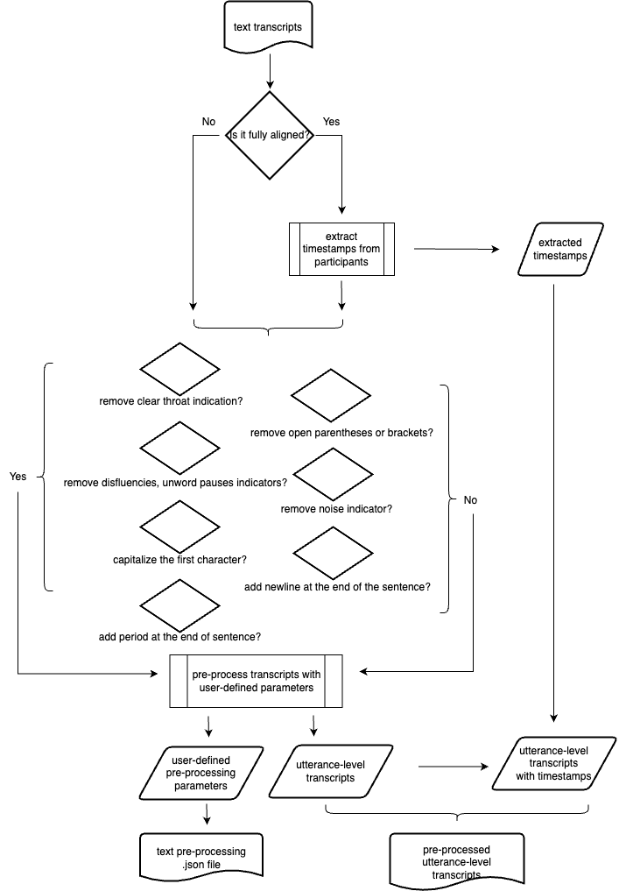
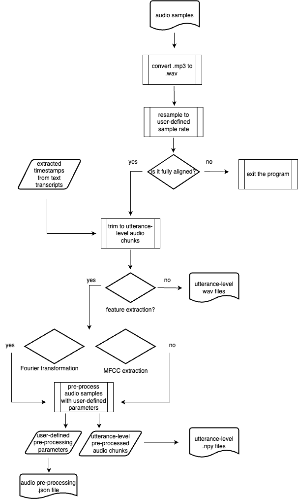

# TRESTLE

This repository contains code developed for TRESTLE (Toolkit for Reproducible Execution of Speech Text and Language Experiments), an open source platform that focuses on two datasets from the TalkBank repository with dementia detection as an illustrative domain.

While the data of Dementia Bank is publicly available, we are not able to redistribute any of these data as per Data Use agreement with Dementia Bank. Individual investigators need to contact the [Dementia Bank](https://dementia.talkbank.org/access/) to request access to the data.

## Setup

It is recommended to use a virtual environment (i.e.,  [venv](https://docs.python.org/3/tutorial/venv.html), [virtualenvwrapper](https://virtualenvwrapper.readthedocs.io/en/latest/), or [conda](https://docs.conda.io/en/latest/)) to use and develop this toolkit. Please install dependency packages using ```pip install -r requirements.txt``` or ```conda install --yes --file requirements.txt``` with python version at least 3.8.

For audio preprocessing, please also install [FFmpeg](https://github.com/FFmpeg/FFmpeg) and [sox](https://github.com/rabitt/pysox) on your local system.

## Usage

### Pre-Processing

This toolkit supports pre-processing of text and audio data for Pitt corpus and WLS dataset. Each module generates a corresponding `.json` file containing all user-defined parameters for pre-processing.

#### Text

To start the pre-processing, simply run `./generate_text_preprocess.sh` in your terminal.

The design of the text module is shown below.



- Remove clear thoat indicator
- Remove open parenthese or brackets
- Remove disfluencies, unword, pauses
- Remove noise indicator
- Capitalize the first character
- Add newline at the end of sentence
- Save the pre-processed **participant-level** transcripts as a .tsv file
- Save the pre-processed **utterance-level** transcripts as *_cha.csv file


#### Audio

The audio module only supports **fully aligned** data - the case where the text transcript has aligned audio timestamps for each utterance-level transcript. The pitt corpus is a fully aligned dataset. However, only a portion of the WLS dataset is fully aligned. Thus the applicibility of audio pre-processing for the WLS dataset is limited.

To start the process, simply run `./generate_audio_preprocess.sh` in the terminal.

The design of the audio module is shown below.


- Convert `.mp3` to `.wav`
- Resample with user-defined sample rate
- Trim out audio samples from investigators (**Note**: this feature only supports fully aligned audio recordings)
- Feature extraction with Fourier transform
- Feature extraction Mel-frequency cepstral coefficients
- No feature extraction - keep the original audio time series array
- Save the audio time series array to local `.npy` files

To load `.npy` file:

```python
import numpy as np
data = np.load("data.npy", allow_pickle=False)
```

#### Combined Pre-Processing

If you want to pre-process a dataset using text and audio at the same time, you can use `generate_full_preprocess.sh`. This is a combined shell script using prompts from the text and audio module.

## For the Hackallenge

### Defining Classes and Data Selection

Participants are required to define their own label to the existing Dementia Bank and WLS dataset. More specifically, participants need to **define** each data samples as one of two categories "positive" vs. "negative" with provided metadata.

### Analysis Pipeline

Participants are required to design their own analysis pipeline with the given pre-processing pipeline.

### Reporting and Submitting Manifest

While we do not ask participants to upload or share their analysis pipeline, participants need to report the details of their pre-processing, data seleciton and analysis pipeline in a **.json** file.

Please find the baseline manifest in the ```files``` folder.

We also provide a simply script to valiate your manifest. Before sumitting, please run ``scripts/manifest_checker.py`` to make sure your manifest is validated.

## Todo
- [ ] Add support of WRAP dataset
- [ ] Add support of `.texgrid` format
- [ ] Add support of various dataset from TalkBank

## Citation

```bib
@article{li2023trestle,
  title={TRESTLE: Toolkit for Reproducible Execution of Speech, Text and Language Experiments},
  author={Li, Changye and Cohen, Trevor and Michalowski, Martin and Pakhomov, Serguei},
  journal={AMIA Informatics Summit},
  year={2023}
}
```